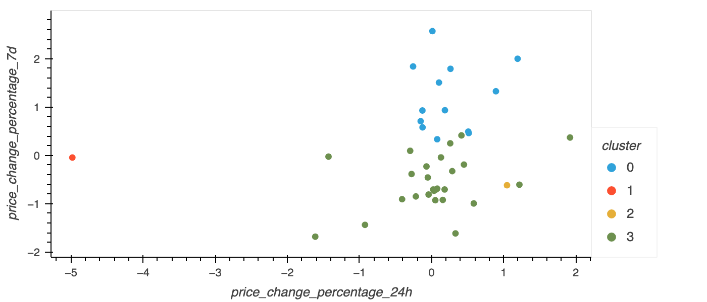
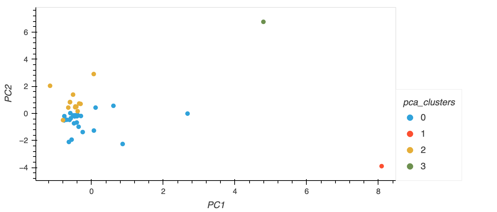

# CryptoClustering

In this challenge we used unsupervised clustering to predict if cryptocurrencies are affected by 24-hour or 7-day price changes.

The challenge used the python machine learning library scikit-learn in Jupyter Notebooks

## Unsupervised clustering

From a dataframe of crytocurrency fluctuations over 60 days, we scaled the data using StandardScalar and used KMeans clustering in a loop to iterate over values for k, the number of clusters. Plotting k against inertia allowed the optimal number of clusters to be determined by the 'elbow method' as 4.

With the optimal number of clusters decided, we assigned each record in the dataframe to a cluster based on the predictions of our model and scatterplotted the data using only 2 columns of the 7 column Dataframe (fit, predict and plot).

## Optimsed CLusters with PCA

We then used PCA to reduce the number of dimensions (columns) in our Dataframe to only three and found that 89.5% of the variance in the original dataset was explained by these components.

We again determine the optimal number of KMeans clusters using the elbow method on this simplified Dataframe. The optimal number for k remained the same as would be expected if only a small amount of information has been lost by performing PCA. Inertia for the PCA dataset was lower than for the original dataset.

We fitted, predicted and scatterplotted the the data again using PC1 and PC1 and observered much more separated clusters with each cluster more tightly grouped around its centroid. 

## Conclusion
This challenge demonstrated the power of KMeans to find clusters in complex data, and the ability of PCA to remove variation while preserving the most important information.